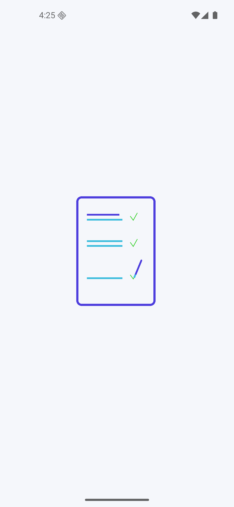
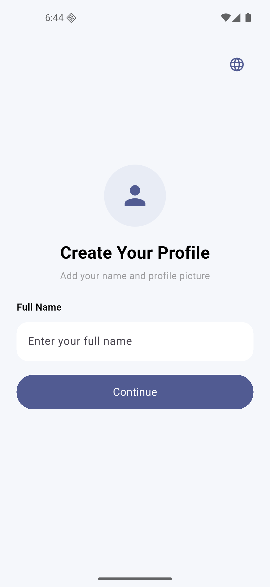
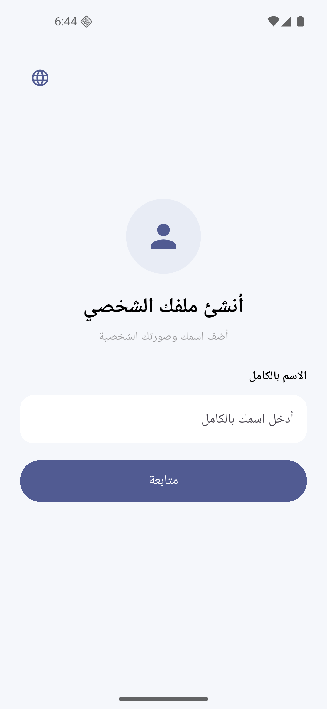

#📝 Taskati App

Taskati is a Flutter task management application designed to help users organize and manage their daily tasks through a simple and clean user interface.

##✨ Features

- 👤 Create user profile
- 📝 Task management
- 🌍 English & Arabic language support
- 🔄 RTL support for Arabic
- 📱 Responsive UI
- 🎨 Clean and modern design
- 🧩 Reusable custom widgets
- 🎬 Animated splash screen
- ✅ Form validation
- 🧭 Screen navigation

##🛠️ Technologies

- Flutter
- Dart
- Flutter ScreenUtil
- Easy Localization
- Lottie

  ## 📱 App Screens
<p align="center">
  
    
  
</p>

<details>
<summary>🌍 Generate Localization Keys</summary>

```bash
dart run easy_localization:generate --source-dir ./assets/translations -f keys -o locale_keys.g.dart -O lib/gen

##📁 Project Structure

```text
lib/
│
├── features/
│   ├── login/
│   │   ├── loginScreen.dart
│   │   └── widgets/
│   │       ├── customTextField.dart
│   │       ├── lang.dart
│   │       ├── profileIcon.dart
│   │       └── buttom.dart
│   │
│   └── home/
│       └── homeScreen.dart
│
├── gen/
│   └── locale_keys.g.dart
│
└── main.dart
<details>
<summary>

## 🌍 Localization

Taskati supports multiple languages using `easy_localization`.

### Supported Languages

- 🇬🇧 English
- 🇪🇬 Arabic

Translation files:

    assets/
    └── translations/
        ├── en.json
        └── ar.json

The application automatically changes the text direction when Arabic is selected.

## 📱 Responsive Design

The application uses `flutter_screenutil` to create a responsive interface across different screen sizes.

Example:

    EdgeInsets.symmetric(
      horizontal: 24.w,
      vertical: 20.h,
    )

</summary>
